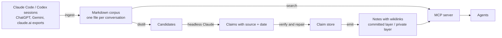

# obsidiyan-engine

[](https://github.com/22wayan/obsidiyan-engine/actions/workflows/ci.yml)

Shared, sourced memory for AI coding agents.

Every new session with Claude Code or Codex starts from zero. Obsidiyan turns the conversations you already had into a searchable corpus and a curated Markdown knowledge base, and gives every agent the same access through an MCP server. Statements in the knowledge base point back to the conversation they came from, and confidential material stays in a layer that is never committed.

I built this for my own work and use it daily. This repository contains the engine only; my own vault stays private.


## Try it in two minutes

Requires Python 3.12 and [uv](https://docs.astral.sh/uv/).

```bash
git clone https://github.com/22wayan/obsidiyan-engine && cd obsidiyan-engine
uv venv && uv pip install -e ".[dev]"

.venv/bin/python -m obsidiyan init ~/obsidiyan-demo --demo
export OBSIDIYAN_HOME=~/obsidiyan-demo

.venv/bin/python -m obsidiyan search Postgres          # finds the demo decisions
.venv/bin/python -m obsidiyan search Acme              # nothing: that session is confidential
.venv/bin/python -m obsidiyan search Acme --include-nda
.venv/bin/python scripts/verify-mcp.py                 # starts the MCP server and checks it end to end
.venv/bin/python scripts/verify-nda.py                 # proves nothing confidential sits in the clean layer
```

`init --demo` creates a vault and ingests four fictional Claude Code sessions. One of them mentions a client called Acme, which is on the example deny list, so it is classified as confidential and hidden from search unless you ask for it explicitly.

## Use it with your own sessions

```bash
.venv/bin/python -m obsidiyan init ~/my-vault
export OBSIDIYAN_HOME=~/my-vault

.venv/bin/python -m obsidiyan ingest --source claude-code   # reads ~/.claude/projects
.venv/bin/python -m obsidiyan ingest --source codex         # reads ~/.codex/sessions
.venv/bin/python -m obsidiyan stats
```

Exports from ChatGPT, Gemini and claude.ai are supported as well (`--source chatgpt|gemini|claude-web`). Put them under `$OBSIDIYAN_HOME/chats/`: ChatGPT as `chats/chatgpt/conversations-*.json`, Google Takeout as `chats/gemini/*activity*.json`, claude.ai as `chats/claude/conversations.json`.

Ingest is incremental: a watermark remembers what was read, so a second run only picks up new or changed sessions.

### Mark what is confidential

Three mechanisms decide whether a conversation is confidential. Confidential documents never show up in search unless `--include-nda` (CLI) or `include_nda` (MCP) is set.

| What | Where | Example |
|---|---|---|
| Project slugs | `DENY_SLUGS` in `obsidiyan/nda.py` | every session in a project folder named `acme-poc` |
| Names in the text | `DENY_TERMS` in `obsidiyan/nda.py` | any conversation mentioning "Acme" (word match) |
| Single conversations | `$OBSIDIYAN_HOME/private/nda-source-overrides.json` | one ChatGPT chat about your health |

E-mail addresses and strings that look like API keys mark a conversation as confidential automatically.

The lists in this repository are placeholders. Replace them with your own clients before the first real ingest, and keep the same names in `DENY` and `DENY_TERMS` in `bin/sync-memory.sh`, which copies Claude Code's auto-memory into the vault.

An override names the source and the `conv_id` from the document's frontmatter:

```json
{"version": 1, "sources": [{"source": "chatgpt", "conv_id": "6650c0de-..."}]}
```

Run the ingest again afterwards; a changed policy reclassifies every document.

### Keep it up to date

`scripts/refresh.sh` copies the auto-memory, ingests every source and runs both checks. Run it by hand, from cron, or as a Claude Code hook in `~/.claude/settings.json`:

```json
{
  "hooks": {
    "SessionEnd": [
      {"hooks": [{"type": "command",
                  "command": "OBSIDIYAN_HOME=$HOME/my-vault bash /path/to/obsidiyan-engine/scripts/refresh.sh"}]}
    ]
  }
}
```

The script exits non-zero when a check fails, so a confidential document in the committed layer does not go unnoticed. Auto-memory of a project the vault has never seen goes to `private/memory/`. To let a project into the committed layer, create `memory/<project-slug>/` once; from then on its files land there unless they contain a denied name, an e-mail address or a secret.

### Connect it to Claude Code

```bash
claude mcp add obsidiyan -e OBSIDIYAN_HOME=$HOME/my-vault \
  -- "$PWD/.venv/bin/python" -m obsidiyan.mcp_server
```

The server offers five tools:

| Tool | What it does |
|---|---|
| `search` | Full-text search, user statements and newer documents rank higher |
| `get_doc` | Full text of one conversation |
| `timeline` | Most recent conversations, optionally per project |
| `remember` | Write or extend a note in the committed layer (`notes/`) |
| `remember_private` | Same for the confidential layer (`private/`) |

Every MCP-capable client (Codex, Cursor, Gemini CLI) can start the same server.

## How it works



1. **Ingest.** Adapters turn session logs and provider exports into one Markdown file per conversation. User turns, assistant turns and machine-written summaries stay separate.
2. **Classify.** A rule-based classifier marks every conversation as clean, confidential or copyrighted, based on the project and the text. Search hides confidential documents unless `include_nda` is set.
3. **Search.** Plain-text search over the corpus, no vector index. User statements rank above assistant answers, newer above older.
4. **Distil** (optional). A daily headless Claude run picks dense conversations, extracts claims (decisions, facts, preferences, open questions) with date and source, verifies every quote against the source and opens a pull request in the vault repository. See `scripts/auto-distill.sh`; it needs the Claude Code CLI and a vault that is a git repository.
5. **Emit.** Claims become notes. When sources contradict each other, the newest dated user statement wins and the conflict stays visible.

## Does it help an agent?

`evals/agent/` measures whether a coding agent answers questions about a project's history better with obsidiyan. The project, Ledgerly, is fictional: 18 work sessions over four months with decisions, reasons, bugs and two reversals (Stripe to Mollie, Unleash to environment variables). 18 questions have fixed answers, graded automatically by key terms.

The same model (Claude Haiku, Claude Code CLI) answers every question in three setups:

- **none:** no access to earlier sessions
- **raw-logs:** the raw JSONL transcripts in the working directory, searchable with Read, Grep and Glob
- **obsidiyan:** only the MCP server

The realistic history adds 240 sessions from three other fictional projects and the tool calls, tool output and thinking blocks that fill real logs. User text is 6.2% of its bytes; in my own 287 Claude Code sessions it is 7.3%.

| Realistic history, 3 runs | Correct | Avg input tokens | Avg cost (USD) | Avg seconds |
|---|---|---|---|---|
| none | 0/54 | 3,693 | 0.0059 | 4.0 |
| raw-logs | 53/54 | 30,256 | 0.0162 | 9.3 |
| obsidiyan | 50/54 | 20,565 | 0.0103 | 6.8 |

On the small clean history (18 sessions, one run) both raw-logs and obsidiyan answer 17 of 18, obsidiyan with 25% fewer input tokens.

What this shows, and what it does not:

- Without memory the agent answers nothing. With either kind of access it answers almost everything.
- obsidiyan reaches nearly the same accuracy with about a third fewer tokens, lower cost and shorter runs. Plain grep over raw logs is a strong baseline at this size.
- obsidiyan missed one question in every run: asked for the *current* payment provider, it found an older decision and another project that still uses Stripe, because the session that switched to Mollie never says "provider". Keyword search does not bridge vocabulary gaps.
- The eval corpus is 3.4 MB; real logs are far larger (mine: 1.4 GB), which should widen the token gap, but this eval does not prove that. 18 questions, one model, synthetic data.
- The eval found two search bugs, both fixed: session titles were not searchable, and a query with one word too many returned nothing instead of the best partial matches.

Reproduce: `python evals/agent/build_history.py --realistic && python evals/agent/run_agent_eval.py --history realistic` (needs the Claude Code CLI). Raw answers per run are in `evals/agent/results/`. `scripts/eval-search.py` runs the retrieval part without a model in CI: the right session ranks first for 17 of 18 agent-style queries.

## How well the classifier works

`scripts/eval-nda.py` runs the classifier against 48 labelled cases in `evals/nda_cases.jsonl`: known client names and project folders, e-mail addresses, nine kinds of secrets, ordinary developer talk and twelve hard negatives such as `Acmeware`, `postgres@localhost`, `logo@2x.png` or `process.env.ANTHROPIC_API_KEY`.

| Metric | Result |
|---|---|
| Recall on confidential cases | 0.87 (26 of 30) |
| Precision | 1.00 (no clean case flagged) |
| Known names, project folders, e-mails, secrets | 26 of 26 |
| Hard negatives | 12 of 12 |
| Confidential text without any known name | 0 of 4 |

The last row is the honest limit of a rule-based classifier: "our client's Q3 revenue dropped" contains nothing it can match. Such conversations are marked by hand in `private/nda-source-overrides.json`. The eval runs in CI and fails if recall drops below 0.85 or precision below 0.95.

Writing the eval found two false positives, both fixed: `task-runner-...` contains `sk-` and looked like an API key, and `logo@2x.png` looked like an e-mail address.

Detected secrets are also removed from the text at ingest, not only classified: the corpus stores `[secret removed]` instead of the key. A key format the classifier did not know (`API_KEY = an_sk_...`) once sat in plain text in a corpus document and surfaced in a search; generic assignments of a long value to a key name are now caught as well.

## Design decisions

- **Provenance over recall.** A claim without a source never reaches a note.
- **The source decides confidentiality, not the claim.** Claims from confidential sources can only land in `private/`, which is git-ignored. `scripts/verify-nda.py` fails if anything confidential would reach the committed layer.
- **The note graph has invariants.** Every note except `BRAIN.md` has exactly one parent. `scripts/verify-graph.py` fails on orphans, duplicate names and ambiguous links.
- **Writes are guarded.** `remember` refuses to append to a generated note, because the next emit would overwrite the addition. It also rejects e-mail addresses, likely secrets and confidential names in the committed layer.
- **No vector database.** Plain search answered the questions I actually ask, so embeddings stayed out.

## Command reference

| Command | Purpose |
|---|---|
| `init [path] [--demo]` | Create a vault; `--demo` adds four fictional sessions |
| `ingest --source <name>` | Read one source: `claude-code`, `codex`, `chatgpt`, `gemini`, `claude-web`, `memory`, `course` |
| `search <terms>` | All terms must match; `"..."` keeps a phrase; filters `--since`, `--source`, `--project`, `--include-nda` |
| `stats` | Documents per source and per sensitivity |
| `distill`, `show`, `add-claims`, `add-reviews`, `emit`, `progress` | The distillation pipeline, see below |

`python -m obsidiyan <command> --help` lists every option.

## Distillation

Distillation turns conversations into short claims with a date and a source, and claims into notes. A human or an agent runs it in steps:

1. `distill --pending` lists conversations with enough user text that are not done yet.
2. `show <doc_id>` prints the user turns of one of them.
3. The agent writes claims as JSON and stores them with `add-claims claims.json`. Claims pointing to a document that is not a current candidate are rejected.
4. Conversations without anything worth keeping are closed with `add-reviews reviews.json`.
5. `emit` rewrites the generated notes from the claim store; claims from confidential sources only reach `private/`. A new entity needs a parent once: `emit --entity-parent shop=notes/projects`.

A claim file looks like this (`kind` is one of `fakt`, `entscheidung`, `praeferenz`, `offen`):

```json
[{"entity": "shop", "topic": "Shop backend", "key": "database", "kind": "entscheidung",
  "text": "The shop backend uses Postgres, because checkout needs one transaction.",
  "stated_on": "2026-05-04", "confidence": "high",
  "source_doc_id": "claude-code/2026/2026-05-04--claude-code--choose-the-database-...md"}]
```

Two claims with the same `key` describe the same thing; the newer one wins and the older one stays visible as superseded.

`scripts/auto-distill.sh` and `scripts/daily.sh` run this unattended with the Claude Code CLI and open a pull request in the vault repository. They are my own macOS setup (launchd, `gh`, notifications); read them before you schedule them.

## Vault layout

```
BRAIN.md            root of the note graph, read first by agents
notes/              curated notes, safe to commit
private/            confidential notes and the override list, never committed
memory/             snapshots of Claude Code auto-memory, committed layer
corpus/             derived Markdown corpus, rebuilt from the sources
distill/            claim and review stores of the distillation
chats/              provider exports you put there, never committed
```

## Troubleshooting

- **`OBSIDIYAN_HOME=... is not a directory`**: run `init` first, or fix the path.
- **`No corpus under ...`**: the vault exists but nothing was ingested yet. Run an ingest or `scripts/refresh.sh`.
- **Search finds nothing you know is there**: the document may be confidential. Try `--include-nda`, then check the deny lists.
- **`ingest --source claude-code` reads 0 files**: Claude Code stores sessions under `~/.claude/projects/<slug>/`. Pass `--session-root` if yours live elsewhere.

## Development

```bash
scripts/check.sh          # ruff, mypy --strict, pytest (283 tests)
.venv/bin/python scripts/eval-nda.py   # classifier eval
.venv/bin/python scripts/eval-search.py   # retrieval eval, no model needed
vhs docs/demo.tape                     # re-record the README demo
```

`AGENTS.md` describes the code layout and the rules for changes; coding agents read it automatically.

CI runs the same checks, an end-to-end demo and a secret scan on every push.

## Status and limitations

- A personal tool in daily use, not a maintained library. Issues are welcome, support is best effort.
- Code comments, log output and some error messages are in German.
- Tested on macOS with Python 3.13 and in CI on Ubuntu with Python 3.12, with Codex CLI rollouts up to version 0.160.

## License

MIT
